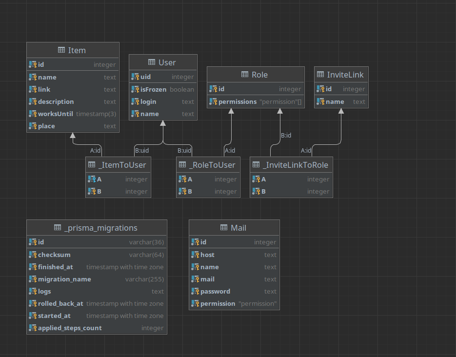

## Контакты

- Author - [Aftilion](https://t.me/Aftilion)

# Cтэк:
### Node.js / TypeScript , Postgresql , FireBase Auth

# Классовая диаграмма

## Описание классов:
### InviteLink - класс для создания пользователей. При добавлении экземпляра класса в базу данных создаётся страница */invite/:id*, на которой незарегистрированный пользователь может зарегистрироваться под тем '*name*' и с теми '*roles*', которые были указаны при создании **inviteLink**. Имя пользователя и пароль создаётся при регистрации.

### User - класс пользователя. Авторизация идёт в экземпляр этого класса. Есть поля: **roles** - для ролей, **isFrozen** - заморозка аккаунта (невозможно зайти в акк, но сохранен в системе).

### Role - класс ролей. Содержит в себе список разрешений, которые доступны для роли.

### Item - класс предмета хранения. Содержит в себе поля: **name** - для имени, **description** - описание, **link** - часть ссылки на предмет (полная ссылка */item/:link*), **worksUntil** - время, до которого предмет возможно использовать и **place** - место хранения.

### Mail - класс почт. Класс хранит в себе поля, необходимые для отпраки сообщений с помощью */mail*. Также ссылается на permission, с помощью которого можно получить доступ к отправки с этого адреса электронной почты.